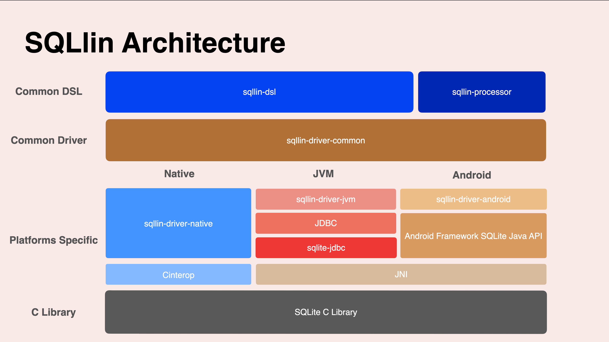

# SQLlin

中文版请见[这里](README_CN.md)

SQLlin is a Kotlin Multiplatform SQLite library that based on DSL and KSP. You can write SQL statements with your Kotlin code and these can 
be verified by Kotlin compiler. Sample just like be this:

```kotlin
private val db by lazy { Database(name = "person.db", path = path, version = 1) }

fun sample() {
    val tom = Person(age = 4, name = "Tom")
    val jerry = Person(age = 3, name = "Jerry")
    val jack = Person(age = 8, name = "Jack")
    val selectStatement: SelectStatement<Person> = db {
        PersonTable { table ->
            table INSERT listOf(tom, jerry, jack)
            table UPDATE SET { age = 5; name = "Tom" } WHERE ((age LTE 5) AND (name NEQ "Tom"))
            table DELETE WHERE ((age GTE 10) OR (name NEQ "Jerry"))
            table SELECT WHERE (age LTE 5) GROUP_BY age HAVING (upper(name) EQ "TOM") ORDER_BY (age to DESC) LIMIT 2 OFFSET 1
        }
    }
    selectStatement.getResult().forEach { person ->
        println(person.name)
    }
}
```
SQLlin is able to insert Kotlin objects into database directly, and could query Kotlin objects directly from database. The serialization
and deserialization ability based on [kotlinx.serialization](https://github.com/Kotlin/kotlinx.serialization).

SQLlin supports these platforms:

- Multiplatform Common
- Android (6.0+)
- JVM (Java 11+, since `1.2.0`)
- iOS (x64, arm64, simulatorArm64)
- macOS (x64, arm64)
- watchOS (x64, arm32, arm64, simulatorArm64, deviceArm64)
- tvOS (x64, arm64, simulatorArm64)
- Linux (x64, arm64)
- Windows (mingwX64)

The architecture design of SQLlin is shown in the figure:



SQLlin has two major parts: _sqllin-dsl_ and _sqllin-driver_. The _sqllin-driver_ is a common multiplatform SQLite low-level
API, most of the time it is not recommended to use it directly. The _sqllin-dsl_ is the SQL statements DSL implementation and based on _sqllin-driver_. 

The _sqllin-processor_ uses KSP to process annotations and generate code for use with _sqllin-dsl_.

You can learn how to use _sqllin-dsl_ in these documentations:

- [Getting Start](./sqllin-dsl/doc/getting-start.md)
- [Modify Database and Transaction](./sqllin-dsl/doc/modify-database-and-transaction.md)
- [Query](./sqllin-dsl/doc/query.md)
- [Concurrency Safety](./sqllin-dsl/doc/concurrency-safety.md)
- [SQL Functions](./sqllin-dsl/doc/sql-functions.md)
- [Advanced Query](./sqllin-dsl/doc/advanced-query.md)

I don't recommend use _sqllin-driver_ directly, but if you want to learn more about it, you can read:

- [The sqllin-driver Basic Design and Usage](./sqllin-driver/README.md)

## R8/ProGuard

Due to _sqllin-dsl_'s deserialization based on [kotlinx.serialization](https://github.com/Kotlin/kotlinx.serialization), R8/ProGuard configuration please refer to
[kotlinx.serialization#Android](https://github.com/Kotlin/kotlinx.serialization#Android).

## License

Distributed under the [Apache License, Version 2.0](https://www.apache.org/licenses/LICENSE-2.0).

See [LICENSE](LICENSE.txt) for more information.