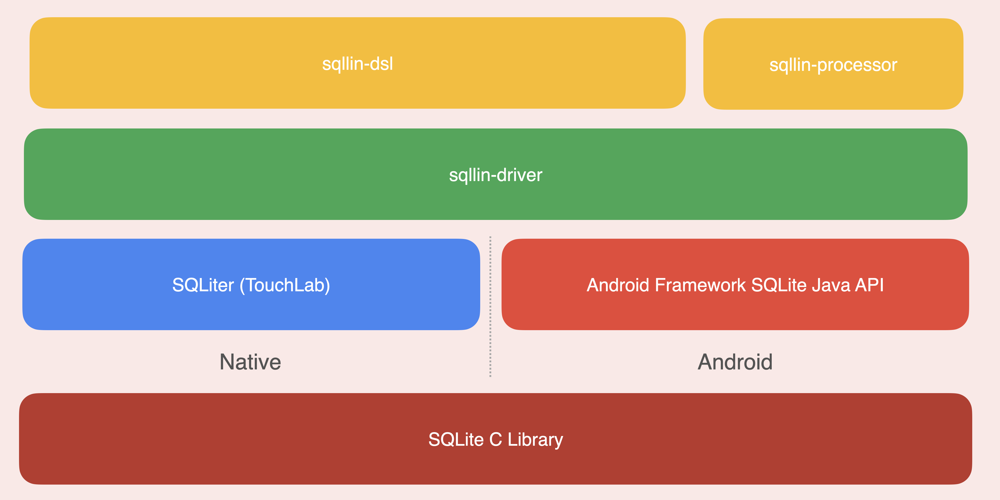

# SQLlin

SQLlin 是一款基于 DSL 以及 Kotlin 符号处理器（KSP）的 Kotlin Multiplatform SQLite 框架。它使你可以在你的 Kotlin 代码中编写能够被 Kotlin 编译器校验的 SQL
语句。示例如下：

```kotlin
private val db by lazy { Database(name = "person.db", path = path, version = 1) }

fun sample() {
    val tom = Person(age = 4, name = "Tom")
    val jerry = Person(age = 3, name = "Jerry")
    val jack = Person(age = 8, name = "Jack")
    db {
        PersonTable { table ->
            table INSERT listOf(tom, jerry, jack)
            table UPDATE SET { age = 5; name = "Tom" } WHERE ((age LTE 5) AND (name NEQ "Tom"))
            table DELETE WHERE ((age GTE 10) OR (name NEQ "Jerry"))
            table SELECT WHERE (age LTE 5) GROUP_BY age HAVING (upper(name) EQ "TOM") ORDER_BY (age to DESC) LIMIT 2 OFFSET 1
        }
    }
}
```

SQLlin 支持如下平台：

- Android
- iOS (x64, arm64, arm32, simulatorArm64)
- macOS (x64, arm64)
- watchOS (x86, x64, arm32, arm64, simulatorArm64)
- tvOS (x64, arm64, simulatorArm64)
- Linux (x64)

SQLlin 的架构设计如下图所示：



SQLlin 拥有两个主要部分：_sqllin-dsl_ 与 _sqllin-driver_。_sqllin-driver_ 是一套通用的多平台 SQLite 低阶 API，大多数情况下不推荐直接使用。
_sqllin-dsl_ 是 SQL 语句的 DSL 实现并且它依赖 _sqllin-driver_。

_sqllin-processor_ 使用 KSP 处理注解并生成用以和 _sqllin-dsl_ 配合使用的代码。

你可以在下列文档中学习如何使用 _sqllin-dsl_：

- [开始使用](./sqllin-dsl/doc/getting-start-cn.md)
- [修改数据库与事务](./sqllin-dsl/doc/modify-database-and-transaction-cn.md)
- [查询](./sqllin-dsl/doc/query-cn.md)
- [SQL 函数](./sqllin-dsl/doc/sql-functions-cn.md)
- [高级查询](./sqllin-dsl/doc/advanced-query-cn.md)

虽然不建议直接使用 _sqllin-driver_, 但如果你想了解更多信息则可以阅读：

- [sqllin-driver 基本设计与使用](./sqllin-driver/README_CN.md)

## R8/ProGuard

由于 _sqllin-dsl_ 的反序列化基于 [kotlinx.serialization](https://github.com/Kotlin/kotlinx.serialization), R8/ProGuard 的配置请参考
[kotlinx.serialization#Android](https://github.com/Kotlin/kotlinx.serialization#Android) 。

## 注意

**SQLlin 目前处于 alpha 阶段，未来 API 可能会发生破坏性变更。** 欢迎向我提交反馈。

## 开源许可

本项目于 [Apache License, Version 2.0](https://www.apache.org/licenses/LICENSE-2.0) 协议下开源。

查看 [LICENSE](LICENSE.txt) 获取更多信息。